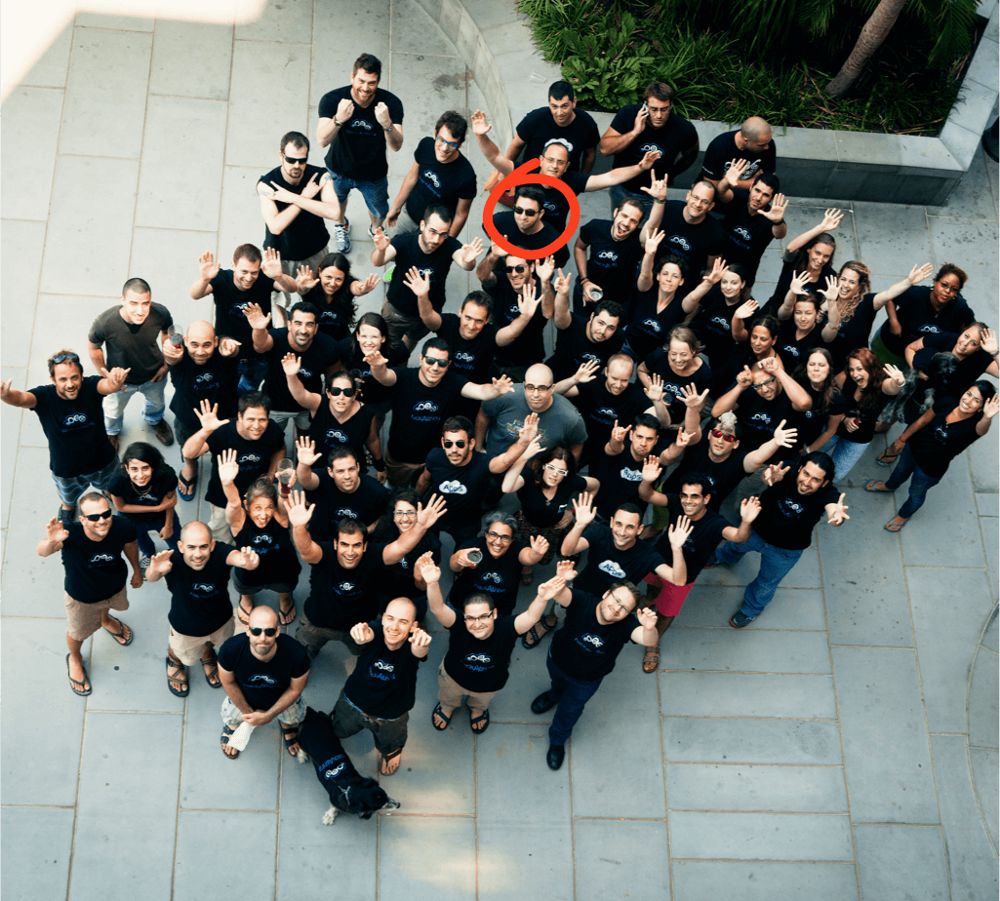
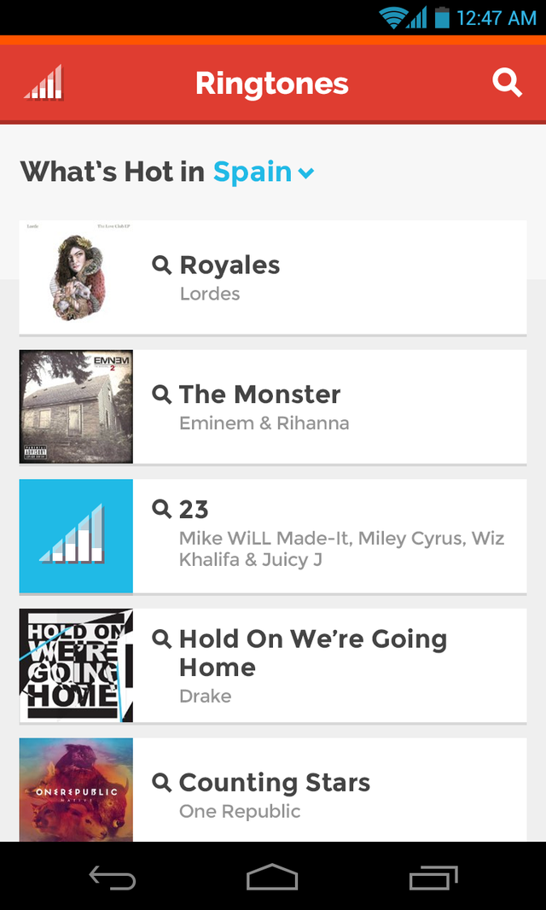
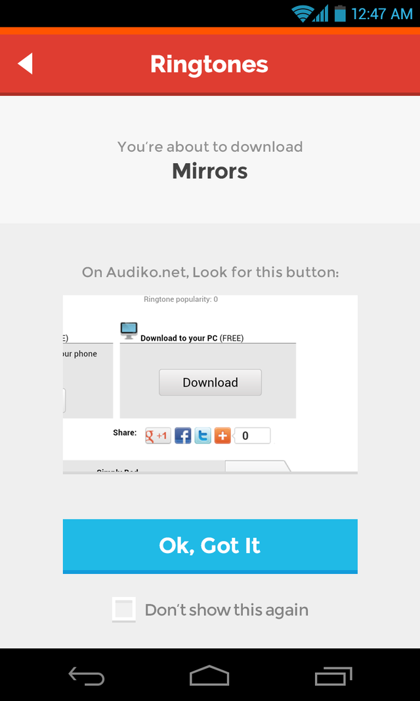
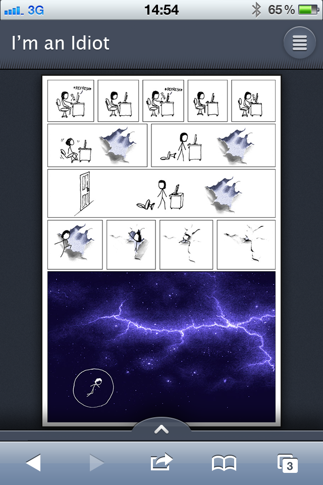
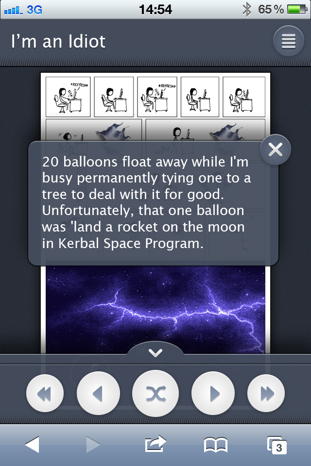
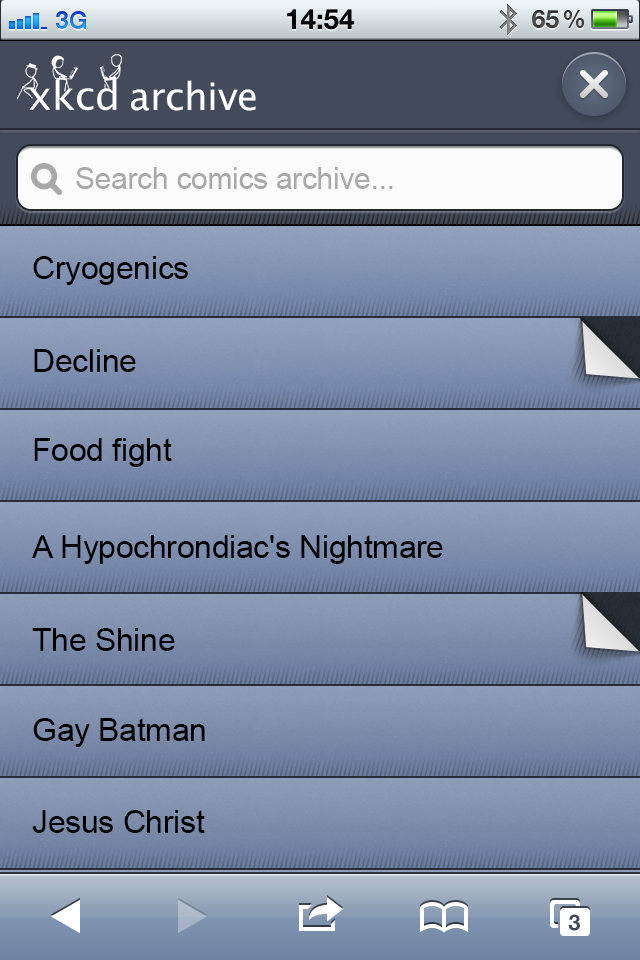

## About the company

EverythingMe started out as DoAT — an app that offered a [better search experience on mobile](http://youtu.be/XBKk2s9nnOg). At the time of its inception (2010), many leading web sites had a complementary native mobile app, but not a mobile-optimized web site. This led many users to download dozens of apps that cluttered their phones only to use them once or twice. Searching the web on mobile meant that sooner or later you'd be pinching and dragging desktop sites on a tiny screen — a sub optimal experience. At DoAT, we collected existing mobile-optimized web sites and apps and created new ones, allowing users to search them all from one place. The user would then get mobile-friendly results from all the top sources, without having to download and install any additional  apps.

The product went through several iterations. The main offering [switched from an iPhone app](http://blog.everything.me/index.php/2013/05/16/iphone-users-this-is-farewell-but-not-goodbye/) to an [Android launcher](http://lifehacker.com/5994507/everythingme-may-be-the-smartest-most-dynamic-android-launcher-yet). In the process, we created a great semantic search engine and a huge collection of mobile websites and apps. Our technology [caught the attention](http://techcrunch.com/2012/11/28/everything-me-the-search-app-that-bridges-the-native-and-html5-divide-gets-25m-from-telefonica-mozilla-and-singtel/) of veteran and new players in the mobile industry, and became the backbone for Mozilla's new Firefox OS search functionality. Today EverythingMe is a [contextual launcher](http://everything.me) that offers users apps and information relevant to their current context (eg. morning routine, at the office, on the road, going out etc.).

## The Team

For the purposes of my work, I usually collaborated with 1 or 2 front end developers and a visual designer.

<figure>
  
  <figcaption>
    Taking a group photo after a day-long hackathon
  </figcaption>
</figure>

## What I did

### Apps manager

I joined EverythingMe as a junior UX designer at the end of 2011. The startup's main offering back then was a search app that would analyze the user's query and return a list of relevant mobile-friendly web sites and apps. These were displayed in a grid of icons, similar to the iPhone’s homescreen grid of apps. When the user tapped one of these icons, they would be transferred into the source’s own search results for the user's query. This allowed users to quickly find information and content on mobile without having to either navigate through desktop only websites or clutter their phones with native apps they rarely use.

My job was to create new mobile web apps for content publishers who had not yet done so, or only on a very limited basis. I worked on apps for Twitter, Instagram, Pandora, Spotify, OpenTable, Urbanspoon, Grooveshark, Google+, LinkedIn, Metacritic, Someecards and many more. Later on, when many of these publishers released mobile web sites of their own, we retired the ones that we had created for them. I also worked on utility apps that we thought were necessary or were popular on native app stores, such as a local business finder, an app that found official websites, a mobile wallpaper finder, a flashlight and more.

My process usually went something like this:

1. **Brief**
I would receive a brief about the required app.

2. **Research**
I would research existing solutions and technologies that we could leverage (mainly APIs  and existing offerings of publishers that we wanted to create substitute apps for).

3. **Interaction design**
I would wireframe the main screens and interactions and write specs.

4. **Visual design**
I would work on visual design with one of the company's designers.

5. **Development**
I would manage the development process, working closely with the designated developers.

6. **Launch**
After QA and the management's approval, I would have the app deployed and add it to our app library.

The apps I created usually had 1-3 screens. They always included a search results page, which the user would reach directly from their EverythingMe results. Sometimes an app would also include a dedicated homepage and other app-specific screens and states. Depending on the user's initial query, apps were supposed to handle different contexts. For example, in location-aware apps, I had to ensure the experience was satisfactory even when the user's location couldn’t be retrieved.

  
  
  
  
  

My job was to have each new app developed as fast as possible, preferably within 2 weeks. During my tenure as apps manager, I oversaw the development of dozens of these apps. Together with the thousands of mobile optimized sites that our content team gathered and indexed, we managed to create a [unique mobile search experience](http://thenextweb.com/apps/2012/03/13/the-best-new-app-at-sxsw-everything-me-redefines-mobile-search/) and content offering, which later aroused considerable interest among other players in the mobile industry.

### Internal tools

After a year or so dedicated to producing new apps, the scene had changed, and most prominent publishers had launched their own mobile-optimized websites. Therefore, the need for new apps started to wane, and I started looking for other interesting projects to sink my teeth into.

#### Content Management System (CMS)

At this time, we were preparing to [launch our product in new territories](http://techcrunch.com/2013/05/28/clever-siri-like-everything-me-android-content-search-app-launches-in-uk-and-spain/), which led to an expansion of our content team. A byproduct of this effort was a total rework of our internal [CMS](https://en.wikipedia.org/wiki/Content_management_system). Re-designing our CMS was something I always wanted to do, so I jumped at the opportunity and offered my help.

The first iteration of the new CMS focused on adding new functionality, so the content team could take on localization assignments. My job was to make sure these new features were consistent with the rest of the system. I used [Bootstrap](http://getbootstrap.com/) to quickly redesign the main screens and make room for these new features.

After the new version was deployed, I was tasked with documenting the CMS to make it easier for new content editors to use (more about this in [Write The F*cking Manual](https://medium.com/@yosefwaysman/write-the-f-cking-manual-6bf1bff96f88)). Realizing that there was still much to improve, I started working on improvements to the CMS and new features. First, I interviewed several members of the content team to get their perspective on the system and understand their pain points. I then created a prioritized backlog of problems to be dealt with. After that, I started tackling each these problems, one at a time. Whenever developers were available to work on the CMS, they had a prioritized list of features and improvements to work on, coupled with specs and wireframes as needed. This way, I managed to get a constant stream of incremental improvements to the system. The content became team happier and more efficient.

#### Alfred

I soon became the go-to guy for every internal project that needed an interface. I designed several other tools and systems, most of which I am not at liberty to disclose. However, there is one tool that I was granted permission to discuss in public — Alfred. When we started our efforts to expand to additional countries, we needed again to create dozens of mobile optimized web apps for major web sites that did not yet have them. These were mainly large content sites in regions like Latin America and East Europe, that had not yet fully embraced the mobile web.

We started building these web apps one by one, which took up considerable development resources that we could have used elsewhere. One of the developers realized that most of these apps were similar in functionality. They were basically a mobile-friendly version of the web site's homepage and search results page. So he abstracted these functionalists to make his own work easier. When I learned of this, I realized there may be a way to make our work even easier: we could build an interface for this back-end tool and let the content team to create these little apps on their own, without the need for a dedicated developer.

I quickly sketched out the main interactions and screens and ran a quick check with the content team. After getting the green light from them, we quickly implemented my design. The new tool, codenamed "Alfred", was soon alive and deployed. This had an immediate impact on the company's operations:

* A very repetitive and time consuming chore was removed from the dev pipeline

* Communication costs were cut

* The content team became independent

* A chokepoint for the internationalization effort was removed

All in all, several dozen of these replacement HTML5 apps were produced with Alfred.

  
  
  
  
  
  

### Firefox OS

**NOTE:** All of my deliverables relating to this section are under an NDA and cannot be shared.

In just over a year, we had so much content that we had begun to capture the attention of some major players in the mobile industry, who did not benefit from the "app store" model. It made us a perfect fit for Mozilla's new mobile operating system — [Firefox OS](https://www.mozilla.org/en-US/firefox/os/). They were building an operating system based on web technologies, but they didn't have any content (apps) to make their devices appealing enough for customers, even in the low-end markets they were targeting. We had a huge collection of mobile optimized web apps, coupled with a powerful search engine. Mozilla saw the potential, and [invested in us](https://blog.mozilla.org/blog/2012/11/28/mozilla-invests-in-everything-me/) (their first ever investment in an outside company). 

Soon enough, a large part of EverythingMe was dedicated to this new partnership. Our aim was to ensure that the key features of our main product (the [Android launcher](https://play.google.com/store/apps/details?id=me.everything.launcher)) were integrated into Firefox OS. I was called in to take charge of the UX aspects of the partnership. In this role, I had 2 major duties:

1. Ensure our features are implemented seamlessly in the new operation system, to create a consistent user experience.

2. Communicate and create a relationship with Firefox OS's UX team, which differed from us significantly in both size and culture.

I started by going through all of the existing [UX documentation](https://wiki.mozilla.org/Gaia) Mozilla had produced. This allowed me to catch up with any developments I may have missed and also to understand how the Mozilla team likes to communicate. To build rapport with them, I decided to present all of our deliverables in their preferred style (it also helped that I really liked it). Here's an example of how [their typical UX specs](https://mozilla.app.box.com/applications/1/864505208/7994695536/1) looked.

I started with creating one massive spec covering all of the features that we wanted to add to the next release. This spec guided our development team for the next several months. During this period I maintained an ongoing relationship with Mozilla's UX team, pitching our features and suggestions, addressing their comments and worries, and generally making sure that things move forward smoothly. We had a weekly video conference with them, where we could freely discuss any UX related topics and report to each other on our progress. Later on, we met at Mozilla's San Francisco headquarters for a week-long workshop in which we planned and brainstormed further integration of our capabilities into Firefox OS’s next versions.

Working with Mozilla taught me how to handle product development in a complex environment and, even more importantly, how to nurture strategic partnerships. I also had the chance to meet and work with top-notch professionals and learn how a company with millions of users and deep pockets creates new products.

## Aftermath

Two and a half years after I joined EverythingMe, the company’s priorities changed and I found that my areas of responsibility were less in need. Nonetheless, I greatly value the time I spent at this company as I learned  some invaluable skills, amongst them:

* **Working with tech**
When I joined EverythingMe, I didn’t even know the difference between "back-end" and “front-end”. But soon enough, I started feeling really comfortable with tech. I can now read and understand  with ease all documentation and specs, and I now design with tech capabilities and constraints in mind.

* **Working with developers**
I had the privilege to work with extremely professional developers. I learned how to communicate with them effectively. Sometimes we worked in a pure waterfall workflow, where I would hand over finished designs and specs to the developer. This taught me how to deliver designs, to cover all edge cases, to specify technological capabilities and dependencies, and to make sure the developers can get straight to work. But whenever possible, we employed an agile approach, where I iterated with developers face to face, exchanging ideas and suggestions in real time to solve problems at hand. Most developers find it fun and simple to work with me.

* **Being professionally passionate**
At EverythingMe, almost everyone was deeply passionate about their work. I found a place where people didn’t just work to make a living. They enjoyed what they did. Many pursued side-projects, participated in hackathons and meetups, wrote and spoke about their work and felt really comfortable geeking out about it. I believe this environment had a great positive influence on me, pushing me to passionately keep expanding my skills and to pursue outside-of-work projects, such as [Open Pension](/projects/open-pension) and [Plint](/projects/plint).

* **Carrying out a vision**
EverythingMe is also where I learned to persevere, to take small steps, to push forward in the face of ambiguity. This is the first place where managers gave me control of a specific domain, and counted on me to not "drop the ball". It took me some time to fully understand what this meant, but eventually I got it. I sometimes found myself under-resourced or working on something outside the central effort of the company. This taught me how to use what I have, to prioritize, to break down big and complex features into something that could be quickly developed and make an impact now. It also taught me that sometimes it’s best to shelve an idea and wait for a better opportunity to present itself. As a result, some projects got stuck or never saw the light of day, some bugs were never fixed, some potential was never realized. But I got better at focusing on the grand scheme, at aligning myself with the bigger goals, at moving forward.

I wasn’t happy to leave EverythingMe, but I felt this experience has equipped me for my next challenges. It was great fun and I’m thankful I got the chance to work there.
