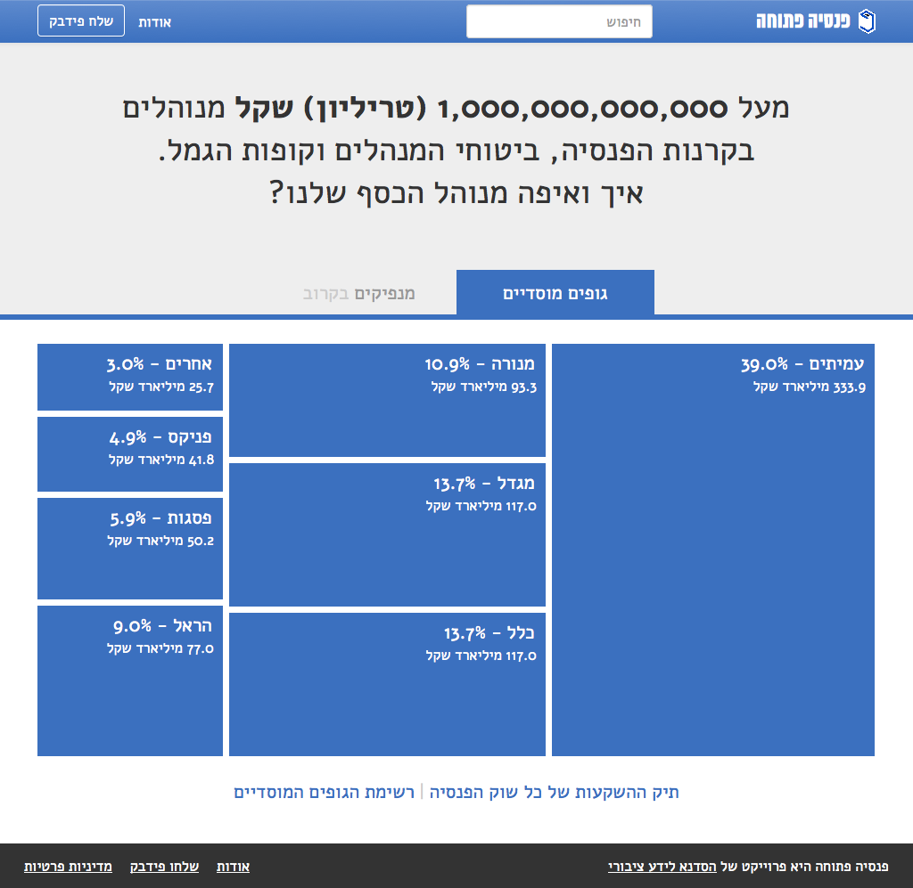
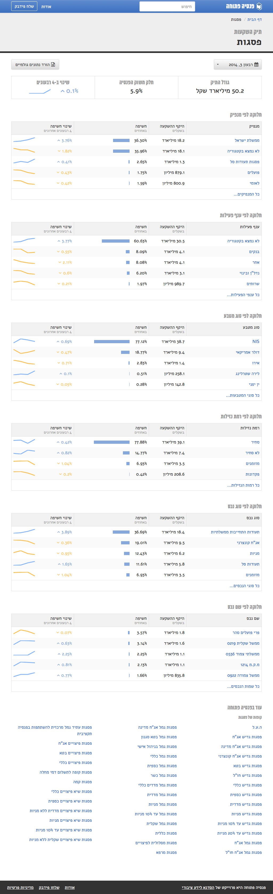
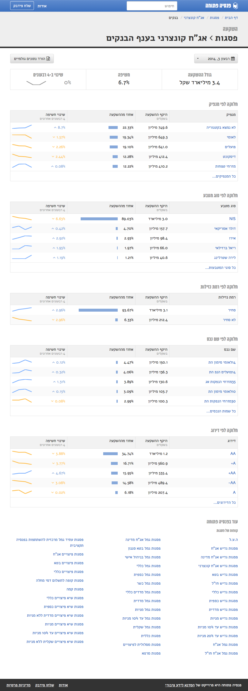

## About the project

The aim of Open Pension is to open up data about the Israeli pension fund market. As a result, we hope to see more public interest in the ways that pension funds manage our money. 

### The problem

In Israel, all employees are required by law to transfer a part of their salary to a pension fund. These funds are managed by institutional investors, mostly private insurance companies. These funds therefore belong to some of the largest players in the capital market, routing huge sums of money into the economy. But data about these investments are hard to obtain and information about the pension market is essentially closed off  to the public. We wanted to create a greater awareness to what’s going on with our money.

Every quarter, hundreds of pension funds are required to publish their asset allocations. This means that the data about each fund's investment policy are available. But no one aggregates these data to allow for higher-level analyses, making it nearly impossible to understand this market’s behavior. We believed that there are groups of people – reporters, researchers, bloggers and activists – who would be interested in digging into aggregate data if they were made readily available. At Open Pension, we do just that: we collect the quarterly reports from each of these funds and aggregate them into a single, clean and standardized database.

### The team and our work schedule

The project is being developed under the auspice of the [Public Knowledge Workshop](http://www.hasadna.org.il/en/). It is developed and maintained by volunteers, including myself, each of whom usually contributes 3-5 hours of work per week. The core team currently consists of several developers, data analysts, and subject matter analysts as well as a single designer – me! Other volunteers contribute their time for shorter periods every now and then.

## What I did

From its inception, the project moved along two parallel tracks: back-end (building the database) and front-end (building the user interface). While the database team started to figure out how to collect the data from close to 700 different quarterly reports, I led the interface efforts. My job was to ensure that as the database evolves, a simple interface will allow users to delve into the data and retrieve any information they might need.

### Initial conversations

At the start of the project, I felt it my responsibility to initiate two conversations regarding the product.

#### Information architecture

<figure>
  
  <figcaption>
    An early chart I drew to make sense of the data
  </figcaption>
</figure>

My first order of business was to become acquainted with the data. I started going over examples of pension fund quarterly reports. For each asset the fund invests in, it is required to report a plethora of details, from type of asset (shares, options, bonds, loans etc) and amount invested to interest rate and estimated value. I soon realized that not all of these details are of equal importance when observing the entire pension market. So I started a conversation about the information most important to our users (more on that below). Soon enough, we managed to narrow the list down to a handful of key data types.

#### Target users

At this time I also thought it necessary to better define our target audience. We all agreed that the project should cater to all researchers and reporters who may be interested in the data. But as in many other open data projects, there was also a latent desire to make the project accessible to the wider public. I advocated that we should cater only to researchers and reporters and not to "the masses". I have explained this approach at length in [my blog](https://medium.com/social-commentary/the-open-data-hubris-70d12be222e0). In a nutshell – it's extremely hard to interest the uninterested in raw data. They need stories that are meaningful to them. Therefore, we have a better chance of attaining our desired impact by making our data accessible to professional storytellers. 

While having my work used by thousands of people is always a dream, I felt that with this project I must insist that we limit the scope to audiences who would make the most use of it. It took a while to get other team members on board, but this approach has paid off. Feature prioritization has become much easier once we reached consensus about our target audience.

### First iteration

#### Design

After the first few team meetings, once I felt that I understood enough to start creating meaningful designs, I started wireframing the main screens with the "mobile first" approach. Although we had no reason to think we'd get a lot of traffic from mobile, I believed that starting from small screens would help us to prioritize features both on the front- and back-end.

The first version assumed that users would want access to the raw aggregate data without much structuring. This means users will essentially have to create their own queries, albeit through a friendly interface, without any guidance from us.

  
  
  
  
  

#### Feedback

It took us about 3 months to implement the design (keep in mind that we each contribute only 3-5 hours a week). At this time, the database was not yet complete (and still isn't, albeit much progress has been made — this remains the project's top challenge), but we started showing it to potential users anyway. After receiving some feedback, and "dogfooding" it ourselves, we discovered that our users do not regard the pension market as a single mass of data to slice and dice. Rather, they see it as comprised of two  distinct entities:

* **Investors** 
The institutional investors who manage the pension funds and decide how to invest the money.

* **Investees**
The recipients of that money, who get it through the assets they sell to the pension funds (shares, options, bonds, loans etc).

In essence, our users are mostly interested in exploring how the money is invested, comparing the investment strategies of the different institutions and revealing possible "dark" connections between investors and investees that influence our savings.

### Second iteration (current version)

#### Design

Upon realizing this, I set out to re-design Open Pension so as to better fit this information architecture. We started with the "investors". Rather than presenting the user with a possibly baffling, open-ended task, the user journey is now more structured and starts by selecting a single institutional investor whose portfolio one would like to investigate. Each portfolio shows the institution’s investments via the parameters that we identified at the outset. For example, users can focus on investments in government bonds, investments in a specific company, investments in the banking industry etc.

For each investment, we show:

* absolute size in NIS
* relative size within the portfolio
* changes over the past 4 quarters

The investments are shown in compact tables, sorted by size. This allows for quick comparison and easy identification of any unusual investments.

  
  
  
  
  

### Feedback and initial achievements

The new design proved to be a big improvement. Users found it much easier to navigate and many have told us that they find the interface’s aesthetics exceptional compared to other products in this area. 

Although the database is still not entirely complete and up-to-date, the design itself brought us appreciation and cooperation from journalists, researchers and policy makers. Even without the complete database, we already have several modest achievements:

* The project was presented to the Director of the Capital Market, Insurance and Savings Department in the Ministry of Finance. She was very impressed with the project and has subsequently directed her office to help expedite the collection of any data that we need from the pension funds. In addition, she has promised to work with us on creating an API for these data, so we won't have to scrape the data from each separate fund. By all measures, this is a significant achievement for a voluntary non-profit initiative such as this.

* In early 2015, Israeli TV [Channel 10 aired a story](http://news.nana10.co.il/Article/?ArticleID=1107391&TypeID=0&sid=126) based on our finding that 31 billion shekels — approximately 4% of the entire Israeli pension market – are invested as loans to anonymous borrowers. This means that no one outside the pension funds has any way of knowing who these funds are being given to. The story aired during the main news broadcast and the insurance companies had to issue a response.

While these are modest achievements, we hope they present a glimpse of the future, when all information about the public’s pension savings is easily accessible and real public scrutiny is achieved.

## Looking forward

Although Open Pension is already online and available to everyone, it is still very much a work in progress. Some core features are still not ready and the current version is somewhat rough around the edges, but we are doing our best to make progress in the modest amount of time that the team can dedicate to the project. 

We’ve also learned that our most sought after users – reporters in high-profile media outlets – don’t necessarily have the time or energy to dig into the data and find interesting stories on their own. As of this writing (mid-2015) we’re in the process of creating relationships with other types of users — bloggers and social activists — who we assume have more motivation to use our product and create the kind of social impact that we are aiming for.

For me, Open Pension is a great opportunity to combine two of my biggest passions: UI design and social change. Although I have always believed that I will be able to achieve this combination at some point, I thought it would happen much later in life, after gaining more experience in the private sector. Open Pension is exactly the type of product I’m excited about, and hopefully I’ll be able to continue nurturing and developing it in coming years.
